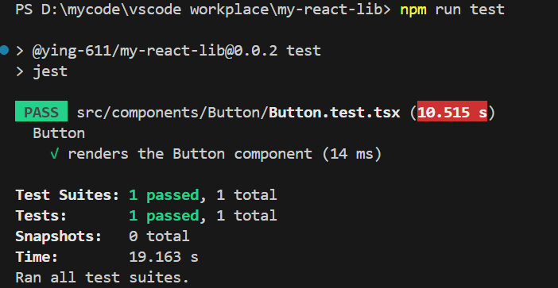

要为我们的组件添加测试，我们将安装 React 测试库，并且要运行这些测试，我们将安装 Jest。

```
npm install @testing-library/react jest @types/jest --save-dev
```

在我们的 Button 目录中，创建一个名为 Button.test.tsx

`src/components/Button/Button.test.tsx`

```
import React from "react";
import { render } from "@testing-library/react";

import Button from "./Button";

describe("Button", () => {
test("renders the Button component", () => {
render(<Button label="Hello world!" />);
});
});
```

这将做的是在非浏览器 DOM 实现上呈现我们的按钮，并确保它正确安装。这是一个非常简单的测试，但它是您可以用来开始使用的语法的一个很好的示例。要更深入地阅读 React 测试库文档。

在我们可以运行测试之前，我们需要配置 jest，并在我们的 package.json. 我们将从配置开始 jest.config.js，在项目的根目录中创建一个文件：

`jest.config.js`

```
module.exports = {
testEnvironment: "jsdom",
};
```

这告诉 Jest 使用 jsdom 作为我们的 DOM 实现。

接下来更新您的 package.json 文件：

`package.json`

```
{
"scripts": {
"rollup": "rollup -c",
"test": "jest"
},
...
}
```

现在我们可以运行我们的测试：

```
npm run test
```

不幸的是，我们会得到一个错误！错误是在遇到我们的 JSX 代码时。如果你还记得我们使用 Typescript 来处理 JSX 和我们的 rollup 配置，还有一个用于 rollup 的 Typescript 插件来教它如何做到这一点。不幸的是，我们没有为 Jest 准备这样的设置。

我们将需要安装 Babel 来处理我们的 JSX 转换。我们还需要安装一个 Jest 插件 babel-jest，它会告诉 Jest 使用 Babel！现在让我们安装它们，连同 Babel 插件来处理我们的 Typescript 和 React 代码。所有这些的总集合看起来像：

```
npm install @babel/core @babel/preset-env @babel/preset-react @babel/preset-typescript babel-jest --save-dev
```

现在我们在项目的根目录中创建 Babel 配置文件，它告诉 Babel 使用我们刚刚安装的所有这些插件：

```
babel.config.js
```

```
module.exports = {
presets: [
"@babel/preset-env",
"@babel/preset-react",
"@babel/preset-typescript",
],
};
```

现在我们应该能够运行我们的测试了 npm run test……但是……还有一个问题！

你会得到一个错误说的 import 了的.css 文件不被理解。这是有道理的，因为我们再次 postcss 为 rollup 配置了一个插件来处理这个问题，但我们没有为 Jest 做这样的事情。

最后一步是安装一个名为 identity-obj-proxy 的包。这样做是允许您配置 Jest 以将任何类型的导入视为通用对象。因此，我们将使用 CSS 文件来执行此操作，以免出现错误。

npm install identity-obj-proxy --save-dev
我们需要更新我们的 Jest 配置 tp 包括 moduleNameMapper 属性。我们还在那里添加了 less 和 scss 以备您以后扩展项目以使用它们：

`jest.config.js`

```
module.exports = {
testEnvironment: "jsdom",
moduleNameMapper: {
".(css|less|scss)$": "identity-obj-proxy",
},
};
```

现在最后，如果你已经跟进到这一点，你可以运行：

```
npm run test
```

此时还有一个问题，在 Jest 28 版本中，jest-environment-jsdom 不再默认提供，需要单独安装。您可以通过以下步骤解决问题：

1. 确保 jest-environment-jsdom 已经安装：

```
npm install --save-dev jest-environment-jsdom
```

1. 在 Jest 的配置文件中，指定 testEnvironment 选项为 jest-environment-jsdom：

```
{
  "testEnvironment": "jest-environment-jsdom"
}
```

通过以上步骤，您应该能够解决报错并成功执行 `npm run jest`。


